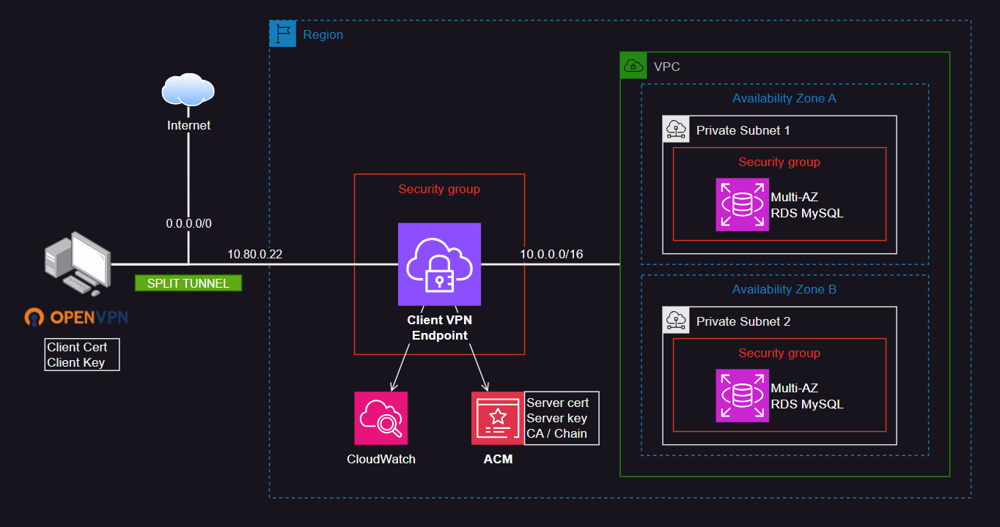

# AWS Client VPN

Add the DNS entry to verify the VPN server certificate.

This repository uses **mutual authentication** architecture following AWS [guidelines][2].



### Generate the certificates

To start, clone the [easy-rsa][1] repository:

```sh
git clone https://github.com/OpenVPN/easy-rsa.git
```

Now trigger the PKI creation process:

```sh
bash scripts/generateCerts.sh
```

You'll be required to provide inputs to the script:

1. The CA common name, like `awsvpn.example.com`
2. `yes`
3. `yes`

The artifacts will be generated in the `./certs` directory.

### Provision the infrastructure

The generated certificates location is already referenced by the configuration.

Simply provision the infrastructure:

```sh
terraform init
terraform apply -auto-approve
```

Once the VPN is provisioned, download the client config, edit the OpenVPN connection, and and connect to AWS following [this guideline][3].

```
Client certificate — easy-rsa/easyrsa3/pki/issued/client1.domain.tld.crt
Client key — easy-rsa/easyrsa3/pki/private/client1.domain.tld.key

<cert>
Contents of client certificate (.crt) file
</cert>

<key>
Contents of private key (.key) file
</key>

Locate the line that specifies the Client VPN endpoint DNS name, and prepend a random string to it so that the format is random_string.displayed_DNS_name. For example:

Original DNS name: cvpn-endpoint-0102bc4c2eEXAMPLE.prod.clientvpn.us-west-2.amazonaws.com
Modified DNS name: asdfa.cvpn-endpoint-0102bc4c2eEXAMPLE.prod.clientvpn.us-west-2.amazonaws.com
```

DNS should work properly as it is replicated by AWS.

## OpenVPN Access Server

Using the Console, subscribe to the [OpenVPN][4] product. There should be no costs associated with it.

For more information, follow the [instructions][5] of the product.

> 🚧 Under construction


[1]: https://github.com/OpenVPN/easy-rsa.git
[2]: https://docs.aws.amazon.com/vpn/latest/clientvpn-admin/mutual.html
[3]: https://docs.aws.amazon.com/vpn/latest/clientvpn-admin/cvpn-getting-started.html#cvpn-getting-started-config
[4]: https://aws.amazon.com/marketplace/pp/prodview-y3m73u6jd5srk
[5]: https://openvpn.net/vpn-server-resources/amazon-web-services-ec2-byol-appliance-quick-start-guide/
